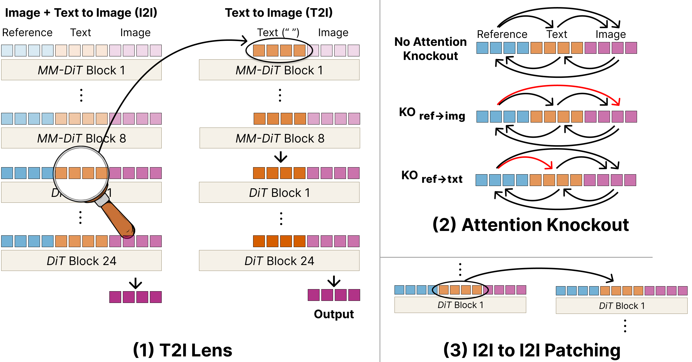

# Vision-Language Binding in In-Context Image Generation

<h3 align="center">

[Project Website](https://chrisg777.github.io/i2i-interp/) | [Paper](https://arxiv.org/abs/2605.24624)

</h3>

FLUX.2 performs in-context image editing by concatenating text, reference-image, and noise tokens into a single attention stream and decoding the noise tokens into the output image. This repo applies three causal interventions on FLUX.2 — T2I Lens, Attention Knockout, and I2I-to-I2I Patching — to trace how reference content reaches the output.

We find that an implicit cross-modal binding emerges between the text tokens and the reference image: the text tokens absorb a portion of the reference content during the forward pass, and that absorbed content causally influences the generated output.



Intervention outputs are scored by a binary-verdict VLM-as-a-judge pipeline (Claude Opus 4.7) against task-specific criteria.

## Repository layout

```
i2i-interp/
├── data/
│   ├── tasks/
│   │   ├── solid_color/                # color transfer
│   │   ├── style/                      # style transfer (fictional refs)
│   │   ├── manual/                     # style transfer (real-photo refs, i2i→i2i targets)
│   │   ├── dreambench_humans/          # 10 humans × 9 individualized prompts
│   │   ├── dreambench_humans_shared/   # 10 humans × 5 shared prompts (i2i→i2i source pool)
│   │   ├── add/                        # SUN397-derived add tasks
│   │   └── remove/                     # SUN397-derived remove tasks
│   ├── style_references/
│   ├── solid_colors/
│   └── datasets/sun397/        # SUN397 image prep + instruction extraction
├── experiments/
│   ├── i2i_to_unconditional/   # T2I Lens
│   ├── attention_knockout/     # Attention Knockout
│   ├── i2i_to_i2i_patching/    # I2I-to-I2I Patching
│   ├── patching/               # shared hook + sweep framework
│   └── common/                 # shared task/runner/CLI helpers used by all three experiments
├── notebooks/
│   └── demo.ipynb
├── scripts/                    # commands to run + judge all experiments
│   ├── reproduce_attention_knockout.py
│   ├── reproduce_t2i_lens.py
│   ├── reproduce_i2i_to_i2i_patching.py
│   ├── run_judge.py
│   ├── v4_status.py
│   └── judge/
├── results_v4/vlm_judge/
├── utils/
└── tests/
```

## Setup

Requirements: Python 3.10+ and [uv](https://docs.astral.sh/uv/).

```bash
git clone <this-repo> i2i-interp
cd i2i-interp
uv sync
```

Set `ANTHROPIC_API_KEY` in your environment if you plan to run the VLM judges.

## Data

| Path | Contents |
|---|---|
| `data/tasks/<bucket>/tasks.jsonl` | all 2,875 task instructions |
| `data/style_references/{fictional,real}/` | 18 illustration + 18 real-photo references for the style transfer tasks |
| `data/solid_colors/` | 8 solid-color references for the color-transfer tasks |
| `data/tasks/customize/images/` | 10 DreamBench++ real-human references for the human identity tasks |

To reproduce the **add/remove object** experiments, you must additionally download [SUN397](https://vision.princeton.edu/projects/2010/SUN/) (research-only license), then run `uv run python -m data.datasets.sun397.prepare_images --root <path-to-SUN397>`. 

## Experiments

### Demo

[notebooks/demo.ipynb](notebooks/demo.ipynb) is a self-contained walkthrough of all three interventions. It loads FLUX.2-Klein 9B, runs the baseline I2I edit, then runs Attention Knockout, T2I Lens, and I2I-to-I2I Patching back-to-back with the full list of hyperparameters. Start here if you want to quickly see what each intervention does.

### Reproducing the paper

To reproduce the results in the paper for each of the three interventions, run these scripts, which include grading the outputs using VLM as a judge. Results land in `results_v4/vlm_judge/<judge>.csv`.

```bash
uv run python scripts/reproduce_attention_knockout.py
uv run python scripts/reproduce_t2i_lens.py
uv run python scripts/reproduce_i2i_to_i2i_patching.py
uv run python -m scripts.run_judge --all
```

Below are the entry points for Attention Knockout, T2I Lens, and I2I-to-I2I Patching:

Attention Knockout:

```bash
uv run python -m experiments.attention_knockout.knockout_run \
    --task-id solid_red_couch \
    --settings 'ref->text' 'ref->image' \
    --full-ko-only \
    --num-inference-steps 4
```

T2I Lens:

```bash
uv run python -m experiments.i2i_to_unconditional.i2i_to_unconditional_patch \
    --task-id solid_red_couch \
    --sweep-mode input_to_block0 \
    --block-range 7 7 \
    --patched-inference-steps 4
```

I2I-to-I2I Patching:

```bash
uv run python -m experiments.i2i_to_i2i_patching.i2i_to_i2i_patch \
    --pair solid_blue_ball_s0 solid_brown_ball_s1 \
    --block-range 17 17 \
    --num-inference-steps 4
```

### Try your own tasks
Single task: the simplest way is through the [notebooks/demo.ipynb](notebooks/demo.ipynb). 

Many tasks (dataset): Append rows to [data/tasks/manual/tasks.jsonl](data/tasks/manual/tasks.jsonl) following the schema below (full field reference at [experiments/common/tasks.py](experiments/common/tasks.py)):


```json
{"task_id": "my_custom_001", "edit_type": "customize", "source": "manual", "instruction": "A photograph of the subject in this image at a beach picnic", "source_image_path": "path/to/your/ref.png", "noise_seed": 42, "height": 1024, "width": 1024, "metadata": {}}
```

Then run any of the three experiments using the new task ID `my_custom_001`.

## Citation

If you build on this code, please cite the paper:

```bibtex
@misc{ge2026visionlanguagebindingincontextimage,
      title={Vision-Language Binding in In-Context Image Generation},
      author={Chris Ge and Rohit Gandikota and Antonio Torralba and Tamar Rott Shaham},
      year={2026},
      eprint={2605.24624},
      archivePrefix={arXiv},
      primaryClass={cs.CV},
      url={https://arxiv.org/abs/2605.24624},
}
```
